# HospitalAI

HospitalAI 是面向医院内部部署的临床药学 AI 决策与科研数据工作台。项目以本地化部署的大模型能力为智能基座，围绕“处方推荐与审核”和“患者追踪与科研沉淀”两条主线，帮助医生在开方前核对患者事实、规则和证据，帮助药师完成处方审核、点评、药历与用药教育，并把经过确认的诊疗事件沉淀为可追溯、可复核、可复现的医学科研资产。

它不是单纯的问答助手或处方页面，而是一个面向医院专科场景的科研型临床 AI 平台：临床数据留在院内，模型推理、规则校验、证据检索、科研统计、报告草稿和知识审核在同一条合规链路中协同运行。

> 当前阶段使用合成/模拟数据进行产品验证，不连接真实医院生产数据，不生成正式医嘱，也不替代医生、药师或科研负责人的专业审核。

## 核心闭环

```text
患者上下文汇总
  -> 处方前候选方案推荐
  -> 医生采纳 / 修改 / 驳回
  -> 处方后安全审核
  -> 真实用药、疗效与不良反应追踪
  -> 科研队列、变量、统计与报告草稿
  -> 专业人员审核
  -> 审核通过的知识结论
  -> 反哺后续处方推荐
```

## 功能页面展示

以下截图来自 `VITE_UI_PREVIEW=true` 预览模式，使用仓库内置 CAP 合成验证场景生成。

| 工作域 | 页面 | 路由 | 页面预览 |
|---|---|---|---|
| 医生工作区 | 患者工作列表 | `/doctor/worklist` | 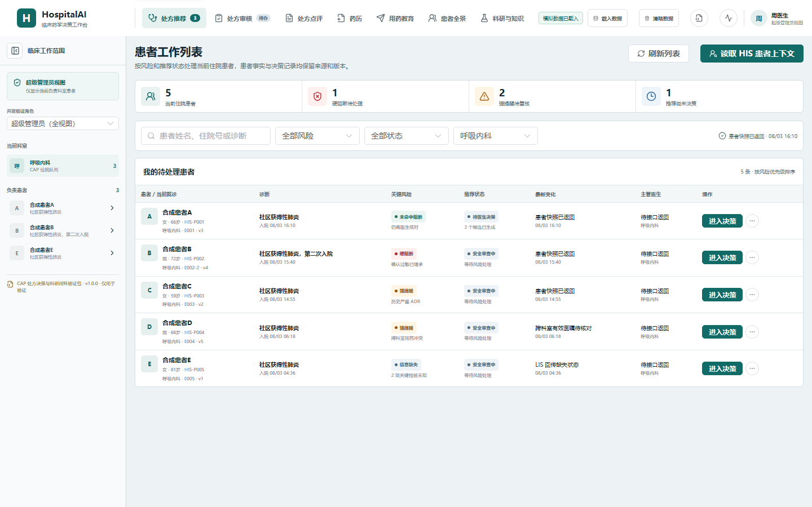 |
| 医生工作区 | 处方辅助决策 | `/doctor/workbench/E001` | 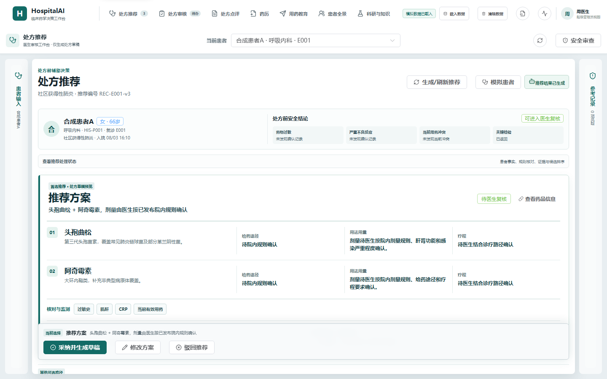 |
| 医生工作区 | 患者用药全景 | `/doctor/patients/P001` | 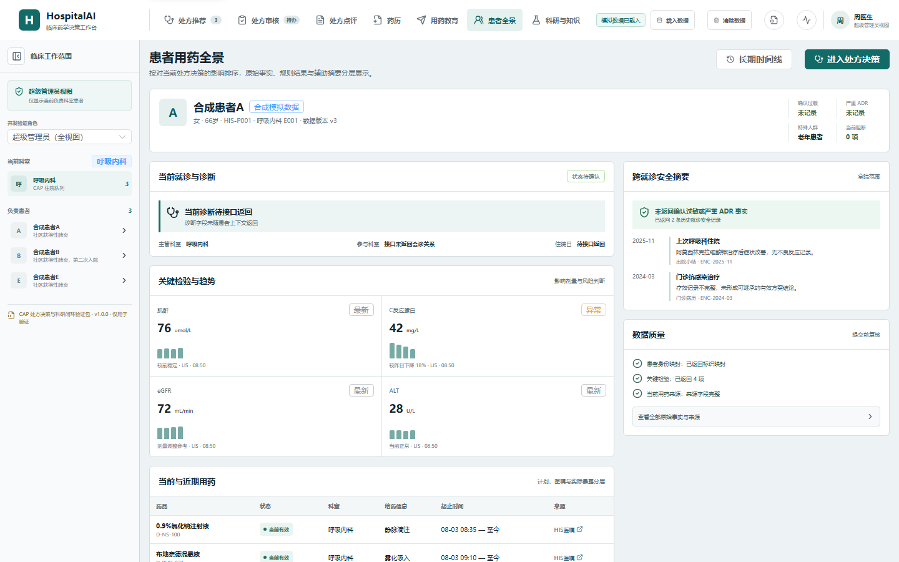 |
| 医生工作区 | 长期用药追踪 | `/doctor/timeline/P001` | 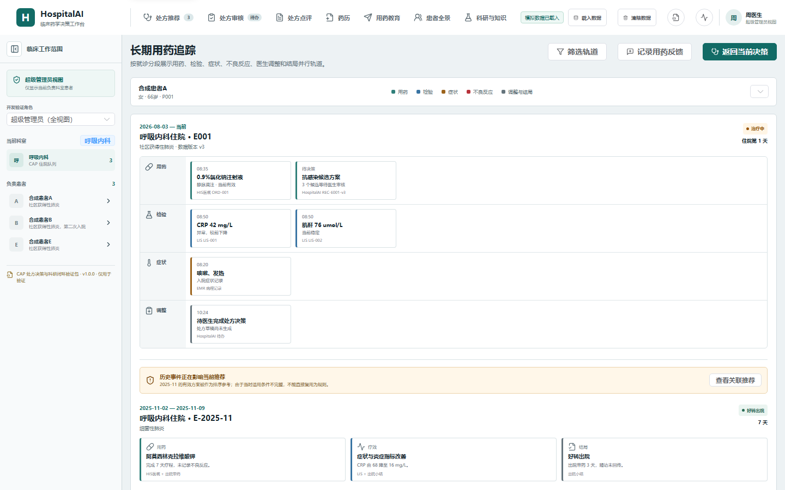 |
| 药师工作区 | 处方审核 | `/pharmacy/reviews` | 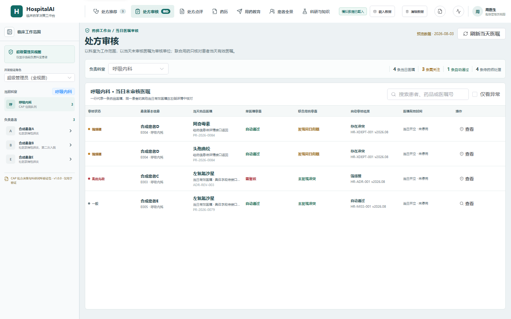 |
| 药师工作区 | 处方点评 | `/pharmacy/retrospective` | 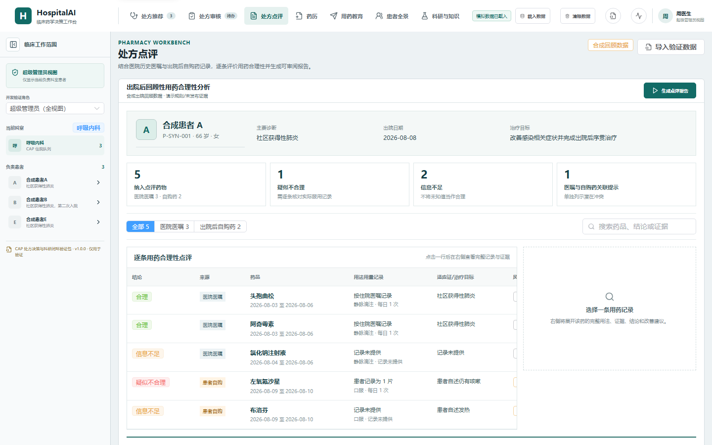 |
| 药师工作区 | 重点患者药历 | `/pharmacy/records` | 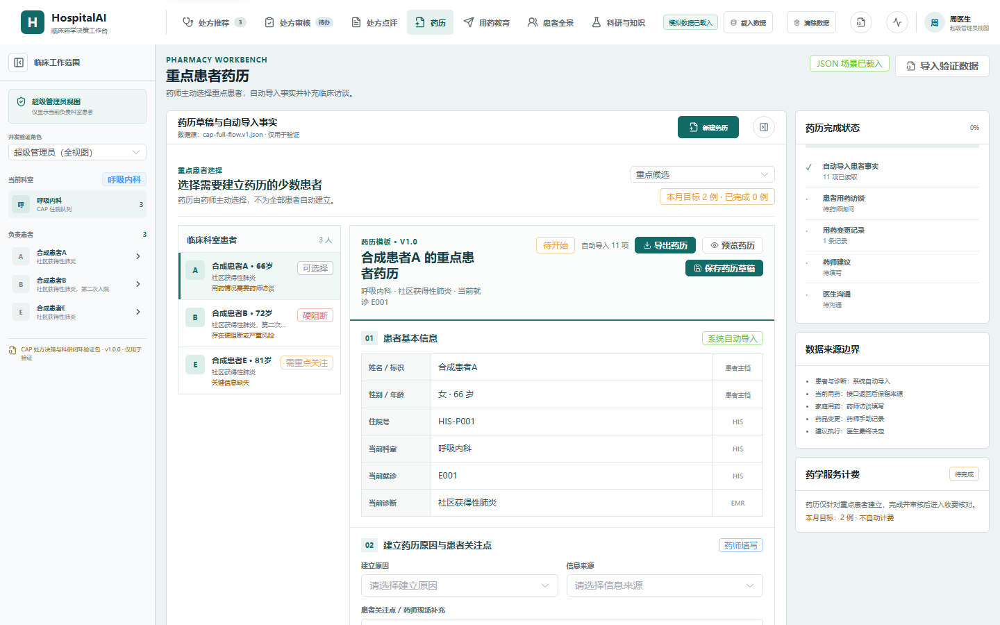 |
| 药师工作区 | 用药教育 | `/pharmacy/education` | 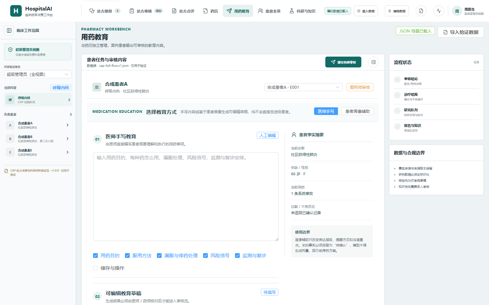 |
| 规则与证据 | 临床规则管理 | `/governance/rules` | 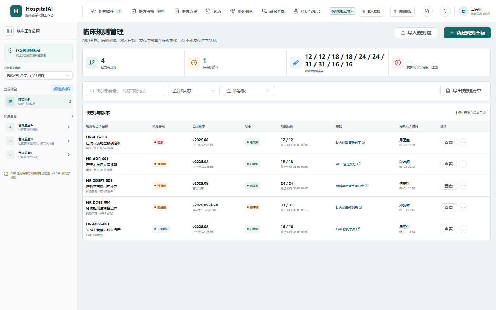 |
| 规则与证据 | 证据资料中心 | `/governance/evidence` | 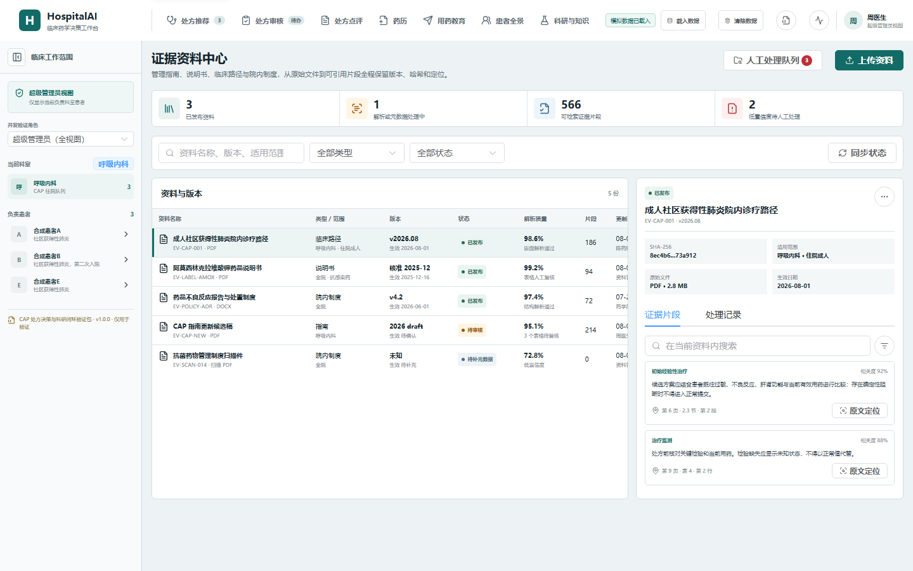 |
| 科研与知识 | 医学科研工作台 | `/research/workbench` | 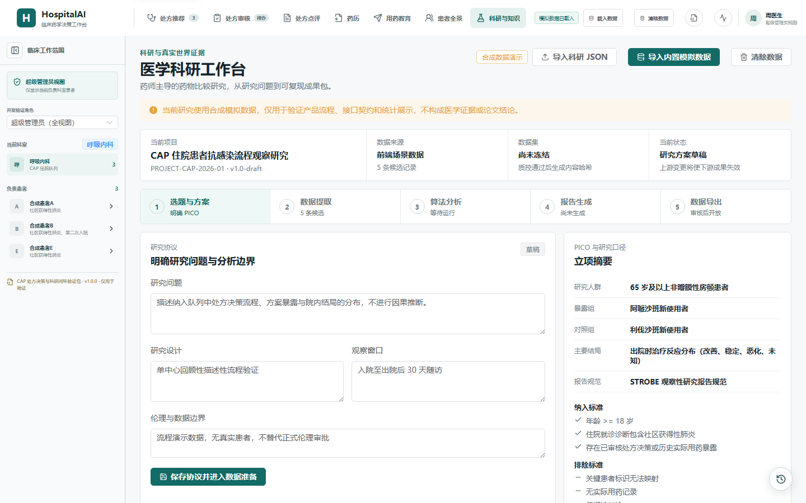 |
| 科研与知识 | 知识审核中心 | `/knowledge/reviews` | 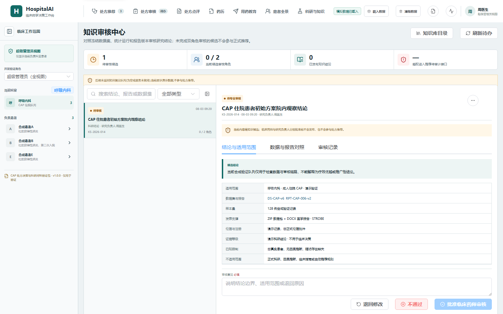 |
| 系统管理 | 接口与同步 | `/admin/integrations` | 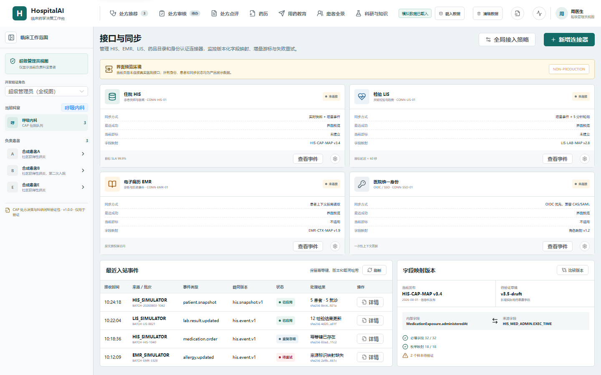 |
| 系统管理 | 审计日志 | `/admin/audit` | 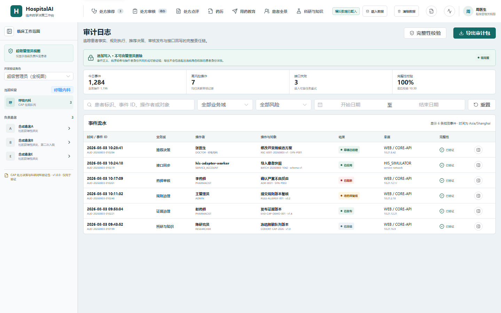 |
| 开发支持 | API 接口文档 | `/developer/api-docs` | 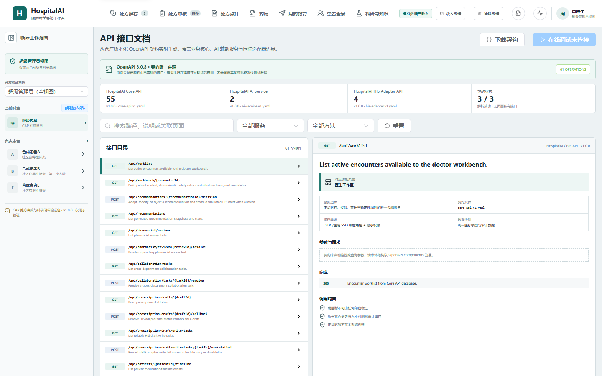 |

## 项目独特优势

- **本地化大模型作为院内智能基座**：模型能力可以部署在医院内网或私有化环境中，围绕院内药品目录、指南资料、规则版本和脱敏病例运行，减少敏感医疗数据外流风险。
- **科研平台能力内嵌临床流程**：系统从处方决策、药师审核、结局记录开始沉淀结构化事件，天然形成研究队列、变量口径、质量检查、统计产物和报告草稿，而不是临床结束后再人工整理 Excel。
- **大模型负责解释、归纳和草稿，规则负责硬约束**：本地模型用于生成可编辑解释、证据摘要、报告初稿和知识候选；过敏、禁忌、剂量、频次、权限和审核门禁由确定性规则与服务端状态机控制。
- **从“开方建议”扩展到完整临床闭环**：不仅给出候选药物，还覆盖医生决策、药师审核、草稿写入、HIS 回调、疗效反馈、不良反应、科研沉淀和知识审核。
- **安全规则优先于大模型生成**：过敏、禁忌、相互作用、剂量和频次等关键判断由确定性规则和版本化证据驱动，AI 只做可解释辅助，不能自由生成关键医学数值。
- **证据链可追溯**：推荐理由、排除原因、规则版本、证据来源、原文定位和数据缺失状态在页面上显式呈现，避免“只给结论不给依据”。
- **医生、药师、科研、信息科同一工作台协作**：传统项目往往只覆盖单个科室或单个流程，本项目把临床决策、药学治理、科研数据和系统审计放在同一产品边界内。
- **科研资产不是事后导表**：用药事件、结局、质量问题、变量口径、冻结哈希、统计产物和报告草稿在流程中自然形成，支持后续复核和复现。
- **知识进入生产前必须审核**：科研报告和个案经验不会直接进入正式知识库，必须经过专业审核和发布流程，降低错误结论反哺临床的风险。
- **真实接入与前端验证解耦**：前端可用版本化 JSON 场景完整演示，生产模式则切换到 Core API、数据库、HIS Adapter 和正式权限审计，不把预览数据伪装成生产结果。
- **面向上线而不是原型演示**：项目保留 OpenAPI 契约、审计日志、角色边界、接口同步、错误态、空态和验收截图，方便逐步替换为真实医院数据链路。

## 技术组成

- **前端**：Vue 3、Vite、Element Plus、Pinia、Vue Router、Playwright。
- **Core API**：Spring Boot、Maven、Flyway，面向患者、规则、证据、推荐、审核、科研和审计提供核心接口。
- **AI Service**：FastAPI，用于本地化大模型调用、AI 解释、证据检索、科研分析和报告草稿生成的服务化封装。
- **契约**：`contracts/openapi/core-api.v1.yaml`、`ai-service.v1.yaml`、`his-adapter.v1.yaml`，以及前端 JSON 场景 Schema。
- **数据边界**：开发预览使用合成数据；生产接入目标是 HIS/EMR/LIS、PostgreSQL/pgvector、正式身份权限与不可篡改审计。

## 本地化大模型与科研平台基座

HospitalAI 的核心设计是“院内数据 + 本地模型 + 确定性规则 + 人工审核”的组合，而不是把病历直接交给通用云端模型处理。

```text
院内 HIS / EMR / LIS / 药品目录 / 指南资料
  -> 数据清洗、脱敏、版本化与证据切片
  -> 本地化大模型检索增强与解释生成
  -> 规则引擎执行安全硬约束
  -> 医生、药师、科研负责人审核确认
  -> 研究队列、统计产物、报告草稿、知识候选
  -> 审核通过后进入院内知识资产
```

### 本地化大模型基座

- 支持在院内私有环境中接入本地或私有化大模型，降低病历、检验、处方和科研数据出院风险。
- 模型不直接生成正式医嘱，只生成候选解释、证据摘要、风险说明、科研报告草稿和知识候选。
- 所有模型输出都保留来源、版本、输入摘要和人工审核状态，方便回溯、撤回和复核。
- 当模型服务不可用时，系统仍保留患者事实展示、规则校验、证据定位和人工决策流程。

### 医学科研平台基座

- 从临床事件中沉淀研究对象，不把科研平台做成孤立的数据导出工具。
- 支持研究队列、纳入排除标准、变量字典、质量问题、数据冻结、哈希校验、统计任务和报告草稿。
- 区分事实数据、计算结果、AI 草稿、人工审核结论和已发布知识，避免未经审核的经验反哺临床。
- 研究产物可以形成带数据血缘、版本哈希和审核记录的科研包，服务院内课题、论文和专病知识库建设。

## 快速启动

### 仅启动前端预览

```powershell
cd D:\WorkProject\HospitalAI\apps\web
$env:VITE_UI_PREVIEW='true'
npm install
npm run dev -- --host 127.0.0.1 --port 5173
```

访问：http://127.0.0.1:5173

### Docker 方式启动全栈

```powershell
cd D:\WorkProject\HospitalAI
docker compose -f infra/docker-compose.yml --env-file .env.example up --build
```

- Web：http://localhost:5173
- Core API：http://localhost:8080
- AI Service：http://localhost:8000

### 本地 H2 演示方式启动 Core API

当 Docker Desktop 未运行或没有 PostgreSQL 凭据时，可以使用 H2 demo profile：

```powershell
cd D:\WorkProject\HospitalAI
$env:JAVA_HOME='C:\Users\ZhouXuan\.jdks\jbr-17.0.14'
$env:Path="$env:JAVA_HOME\bin;$env:Path"
$env:SPRING_PROFILES_ACTIVE='h2-demo'
$env:AI_SERVICE_BASE_URL='http://127.0.0.1:8000'
$env:SERVER_PORT='18080'
.\.tools\apache-maven-3.9.9\bin\mvn.cmd -f services/core-api/pom.xml spring-boot:run
```

另开终端启动 AI 服务和前端：

```powershell
cd D:\WorkProject\HospitalAI
.\.venv-ai\Scripts\python.exe -m uvicorn app.main:app --host 127.0.0.1 --port 8000
```

```powershell
cd D:\WorkProject\HospitalAI\apps\web
$env:VITE_CORE_API_BASE='http://127.0.0.1:18080'
npm run dev -- --host 127.0.0.1
```

## 本地验证

```powershell
cd D:\WorkProject\HospitalAI
npm install
npm run test:contracts
npm --prefix apps/web install
npm --prefix apps/web run test
npm --prefix apps/web run build
.\.venv-ai\Scripts\python.exe -m pytest tests -q
docker compose -f infra/docker-compose.yml --env-file .env.example run --rm core-api mvn test
```

Java 相关检查需要 Docker 或本地 JDK/Maven。

## 开发路径

### M1 真实数据链路基座

- 已完成：迁移目录、契约校验、HIS snapshot 导入契约、Core API 导入骨架、前端工作列表 API 化。
- 待推进：PostgreSQL/pgvector 集成测试、真实医院导出样例字段映射、CI 基线。

### M2 规则与证据治理

- 已完成：规则版本、规则病例、规则生命周期 API、剂量计算器、证据资料数据库骨架。
- 待推进：证据人工审核 UI、真实文件解析 Worker、pgvector 检索链路。

### M3 推荐审核闭环

- 已完成：推荐快照、医生决策、强提醒药师复核、处方草稿幂等写入、HIS 回调状态。
- 待推进：真实 HIS Adapter 网络对接、后台 Worker 调度、字段级 regimen diff。

### M4 患者追踪与科研资产

- 已完成：患者时间线、反馈/ADR/结局回读、研究队列、变量字典、冻结、导出、统计产物、报告草稿和知识审核流程。
- 待推进：药历/用药教育专用写接口、下载权限、复现实验目录、正式知识库 UI。

### M5 上线级质量门槛

- 已完成：开发环境角色头和部分关键端点权限约束。
- 待推进：OIDC/SSO、完整 RBAC/ABAC、超级管理员双重约束、OpenTelemetry、备份恢复演练、安全扫描、依赖审计、性能压测和最终验收矩阵。

## 关键文档

- `医院AI药学系统_MVP产品需求文档.md`
- `docs/06_FRONTEND_INFORMATION_ARCHITECTURE.md`
- `docs/07_FRONTEND_FLOW_SIMULATION.md`
- `docs/10_FRONTEND_BACKEND_API_CONTRACT.md`
- `docs/12_MEDICAL_RESEARCH_PLATFORM_PRD.md`
- `docs/05_DEVELOPMENT_TASK_LIST_COMMERCIAL.md`
